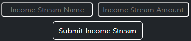
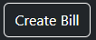
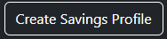

     
    <h1><code>IncomeStream</code></h1>
    
<code>IncomeStream</code> is a utility to help me with finances because I am <b>really</b> bad with them.

 

# Documentation
> Documentation for `IncomeStream` will be hosted at [my Documentation Portal](https://docs.connorbug.com/incomestream), but if the doc-gen isn't ready yet, you can find it here.

## Income Streams, Bills, and Savings Profiles
### Income Streams
An **Income Stream** is any one line of income provided in your household. Your significant other might make $1,200 a pay-period (IncomeStream is intended to be used pay-period-wise, but it can work Monthly and Yearly too), and you might make $1,600 a pay-period. Each of you qualify as your own Income Stream.

### Creating Income Streams
You will want to find the button that looks like this button below: 
 

When you click it, a menu will appear that looks as follows: 

**Income Stream Name** - This is a text input where you will name your Income Stream. It can be your place of work, the person earning it, or anything you want.

**Income Stream Amount** - This is a text input where you will enter your gains over the course of whatever time you want. It could be a pay-period (bi-weekly), a month, or even a year. You will need to inflate/deflate Bill Costs and Savings Profile Additions to match this though.

**Submit Income Stream** - Click this when both fields are entered.

### Creating Bills
Obviously, nobody likes bills. They take your money. But, alas, they must be added anyways.

Find the button that looks as follows: 
 
Then, you'll see an interface similar to the previous one.

**Bill Name** - The name of the bill.
**Bill Cost** - How much the bill will cost you.

**Note: you do not need to put Savings in here, as that is what Savings Profiles are for.*

After you're done, hit the Submit Bill button. 

### Creating Savings Profiles
 
Savings Profiles are a *tiny* bit more complex than the other two. 
You can insert your Profile Name and the amount you'll be putting in, of course, but then there's the "Current Amount".

This is how much you currently have in your Savings. 
**Note: You will need to add the amount for each Pay Period.*

## Any questions?
Submit an issue and I'll try to get to it. Thanks!